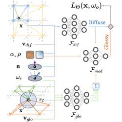

# Neural Cone Radiosity

Official implementation of **Neural Cone Radiosity (NCR)** for interactive global illumination with glossy materials.

> Jierui Ren, Haojie Jin, Bo Pang, Yisong Chen, Guoping Wang, Sheng Li<br>
> *Neural Cone Radiosity for Interactive Global Illumination with Glossy Materials*<br>
> [[arXiv]](https://arxiv.org/abs/2509.07522) &nbsp;|&nbsp; [[PDF]](https://arxiv.org/pdf/2509.07522)



Neural radiosity methods that rely mainly on positional encodings struggle with high-frequency, view-dependent radiance, especially on glossy surfaces. NCR extends the neural radiosity framework with **reflectance-aware ray cone encoding**: a glossy BSDF lobe is treated as a ray cone, whose projected footprint is approximated by clustering reflected hits and querying a pre-filtered multi-resolution hash grid. A dual-branch network (diffuse + glossy) with a lightweight modulation MLP then predicts outgoing radiance across a wide range of glossiness, from highly polished surfaces to low-sheen finishes.

This repository provides training, interactive viewing, and offline rendering on top of a customized [Mitsuba 3](https://mitsuba-renderer.org/) (v3.5.2) backend.

## Method

- **Cone encoding.** Instead of a single reflected ray, NCR traces a roughness-dependent cone, embeds the cone–surface footprint into a pre-filtered hash grid, and interpolates features at the matching spatial scale.
- **Clustering approximation.** Reflected rays inside the cone are grouped with 1D *k*-means on marching distance; each cluster is queried once and aggregated by sample weight.
- **Dual-branch radiance model.** A diffuse hash-grid MLP, a compact glossy MLP, and a modulation network blend the two branches according to roughness and reflectance.

At interactive rates the paper uses T = 32 glossy samples per shading point (K = 4 clusters). Training uses T = 128. On an RTX 3090, per-scene training takes about 0.5–2 hours.

## Installation

### Python environment

```bash
conda create -n mi3 python=3.9
conda activate mi3
pip install -r requirements.txt
pip install git+https://github.com/NVlabs/tiny-cuda-nn/#subdirectory=bindings/torch
```

A CUDA GPU is required (`cuda_rgb` Mitsuba variant). Custom CUDA extensions (hash grid, 1D *k*-means) are compiled on first use via `torch.utils.cpp_extension`.

### Mitsuba 3.5.2

Build our customized Mitsuba 3.5.2 and place it next to this repository:

```text
../official-submodules/mitsuba3-old
```

1. Clone [mitsuba3-old](https://github.com/Jerry18231174/mitsuba3-old) into `../official-submodules/`.
2. Compile following the [Mitsuba 3.5.2 compiling guide](https://mitsuba.readthedocs.io/en/v3.5.2/src/developer_guide/compiling.html).
3. Before training or rendering, source the Mitsuba environment:

```bash
source scripts/active_mitsuba.sh
```

## Usage

Configs live in `configs/`. The default `ncr` config matches the paper architecture (4-level diffuse hash grid + 8-level glossy hash grid, cone threshold τ = 0.99, K = 4 clusters).

Paper scenes: `bathroom`, `cornell-box`, `kitchen`, `living-room`, `veach-ajar`. Additional scenes are included under `scenes/`.

### Train a scene

```bash
source scripts/active_mitsuba.sh
python train.py -c ncr -s veach-ajar
```

Training and rendering are single-GPU only. If the machine has more than one GPU, pin a single device before running:

```bash
export CUDA_VISIBLE_DEVICES=0
```

Checkpoints are written to `out/<scene>/checkpoints/NCR/`. TensorBoard logs go to `out/<scene>/tb_logs/`.

**Training hyperparameters** (already set in `configs/ncr.json`):

```json
"n_glossy_rhs": 128,
"n_kmeans_iter": 10
```

If large regions of the scene are occluded from the default camera, collect extra views so unshaded surfaces are sampled:

1. `python render.py -c ncr -s <scene>`
2. Move to an unoccluded pose and tick **Save camera config**.
3. Copy the saved `.npz` files into `scenes/<scene>/camera_poses/`.

### Interactive rendering

```bash
source scripts/active_mitsuba.sh
python render.py -c ncr -s veach-ajar
```

In the viewer, set the integrator to **LHS** (network evaluation at the primary hit, as in the paper). Path / RHS / deferred modes are available for comparison.

**Rendering hyperparameters.** For interactive frame rates, set in the config (or a copy of it):

```json
"n_glossy_rhs": 32,
"n_kmeans_iter": 3
```

Optional viewer flags: `--denoise` (FXAA / bilateral post-process used in the paper), `--ref path/to/ref.exr` (live error vs. a reference).

### Offline image

```bash
python scripts/render_image.py -c ncr -s veach-ajar -r LHS -o ncr_lhs
```

The image is written to `out/<name>.exr`. Use `-r PT` for a path-traced reference.

## Citation

If you use this code, please cite:

```bibtex
@article{ren2025neural,
  title     = {Neural Cone Radiosity for Interactive Global Illumination with Glossy Materials},
  author    = {Ren, Jierui and Jin, Haojie and Pang, Bo and Chen, Yisong and Wang, Guoping and Li, Sheng},
  journal   = {arXiv preprint arXiv:2509.07522},
  year      = {2025},
  url       = {https://arxiv.org/abs/2509.07522}
}
```

## Acknowledgements

This implementation builds on [Mitsuba 3](https://mitsuba-renderer.org/), [tiny-cuda-nn](https://github.com/NVlabs/tiny-cuda-nn), and the neural radiosity formulation of Hadadan et al. Test scenes are adapted from the [Bitterli rendering resources](https://benedikt-bitterli.me/resources/).
